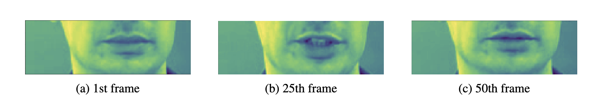
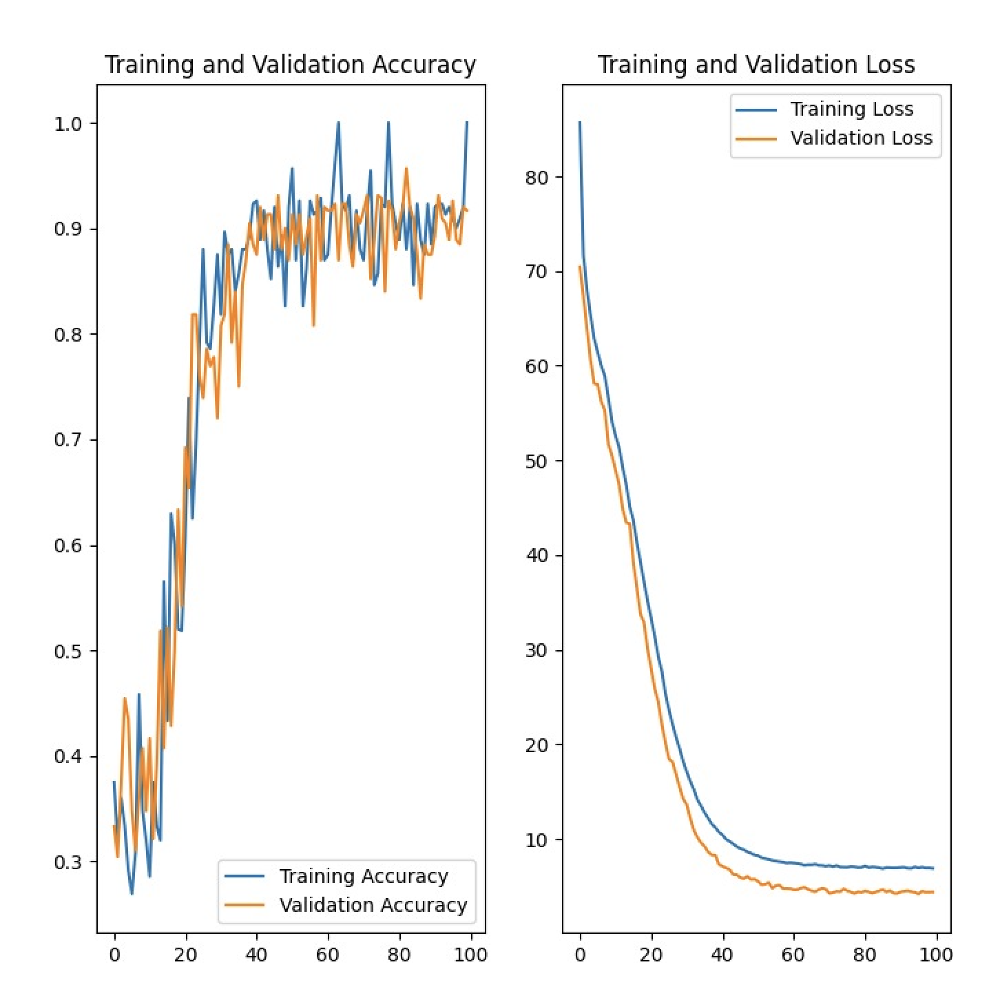
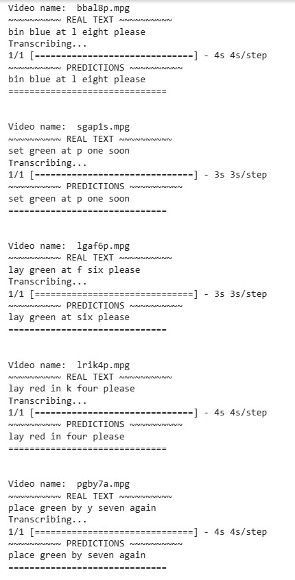

# Video Transcribing Using Lip Reading

## Problem Statement

The goal of this project is to predict sentences through lip reading, utilizing the GRID dataset.

https://github.com/rahul-m-patel/Lip_Reading_Project/assets/44569635/17c6f01f-b054-499c-9597-cb2d92ce3c2f


## Project Overview

### 1. Frame Cropping to Focus on the Mouth Region

- Given that our dataset comprises stationary, front-facing camera videos with minimal movement, we opted for manual frame cropping.
- We also verified our results with a pretrained dlib model can dynamically crop the mouth region and observed similar results.
- Example of cropped frames:

    

### 2. Model Training

- The model architecture is inspired from LipNet, focusing on sentence prediction via lip reading.
- To train the model, run the following command in your terminal:

    ```bash
    python lipreading.py
    ```

- After training, the model is saved in `/results` as `checkpoint.pth`, and convergence plots are saved in the root folder as `convergence_plots.png`.

    

### 3. Inference

- Predictions on five videos:

  
